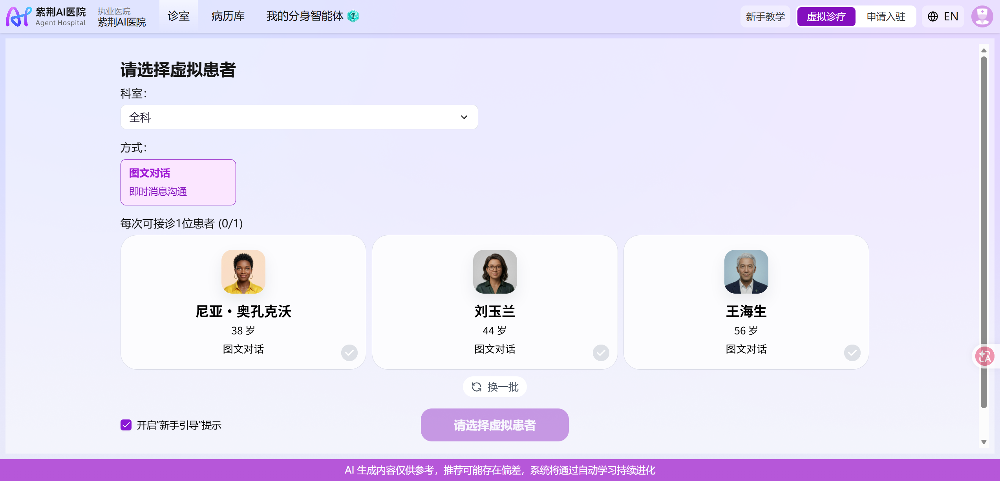
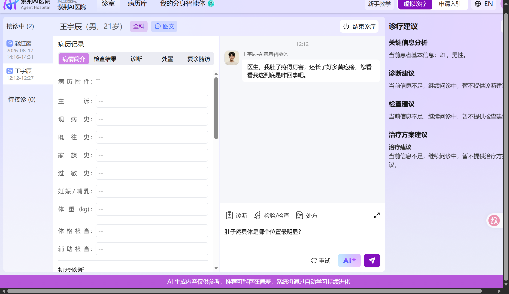
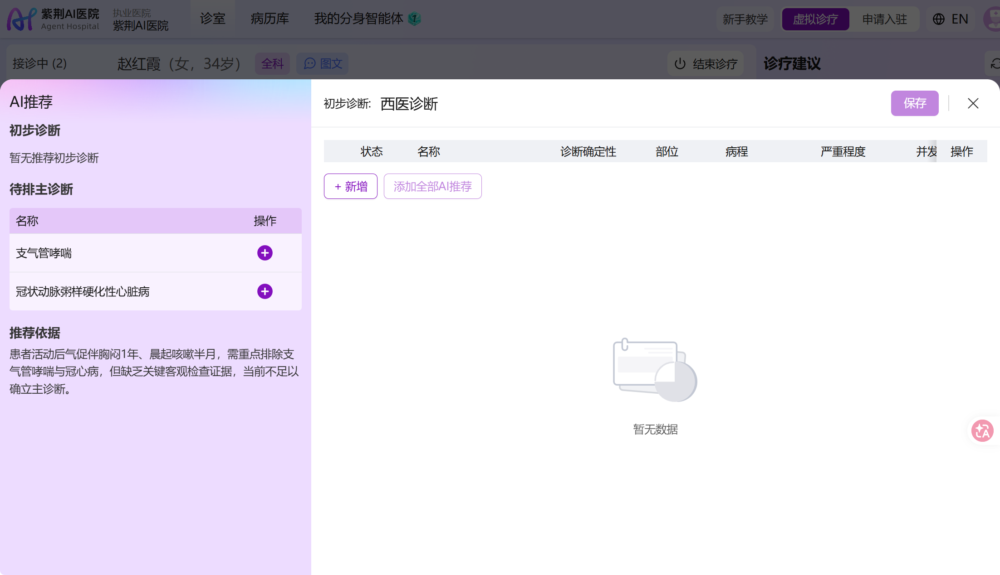
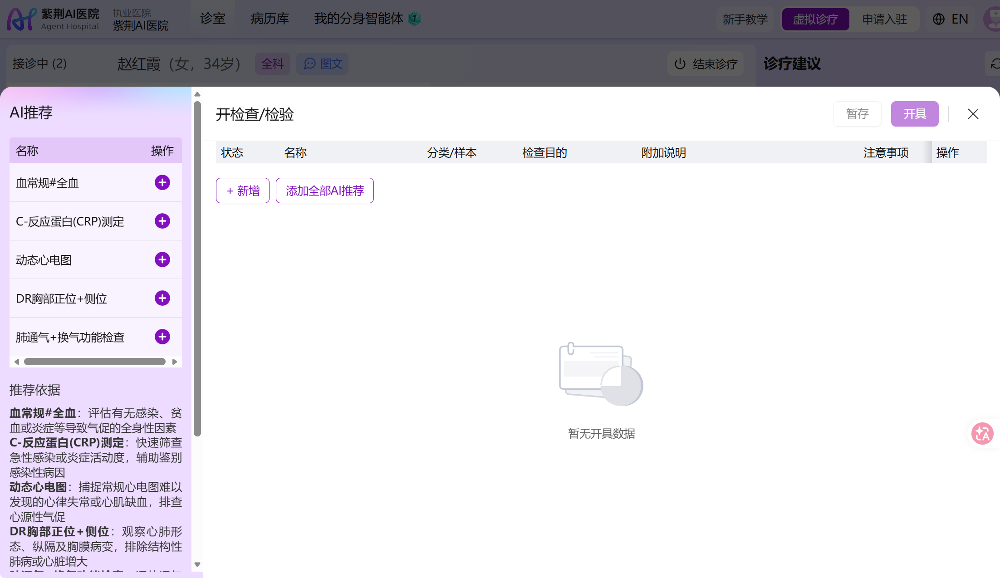
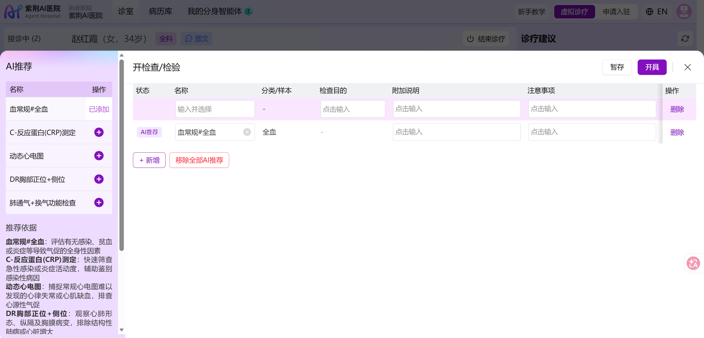
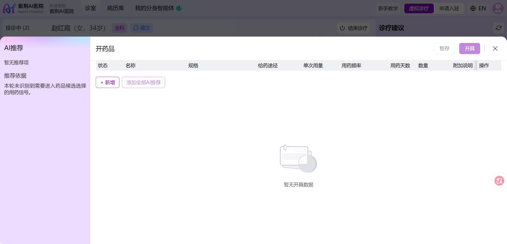
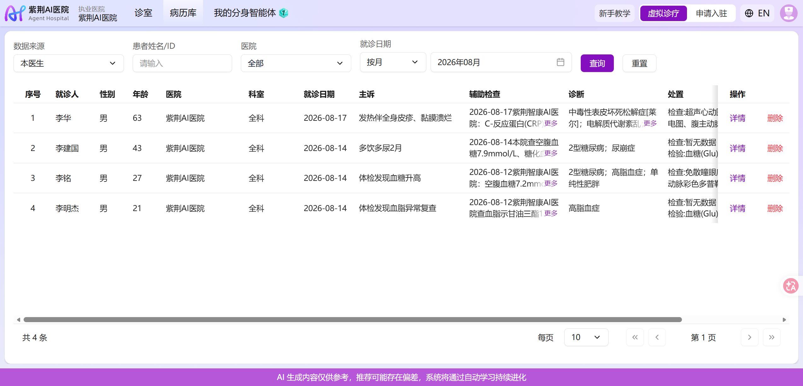

# 紫荆 AI 医院线上虚拟诊室实机分析

## 范围与证据边界

本文分析紫荆智康医生端线上虚拟诊室的产品定位、真实页面结构、虚拟诊疗闭环和 Agent 交互方式，为 ClinMesh 的门诊医生工作台、虚拟患者、病例工坊与嵌入式助手设计提供参考。研究记录不定义 ClinMesh 当前行为；正式架构和领域状态仍以[系统架构](../architecture.md)与[领域词汇](../../CONTEXT.md)为准。

证据截至 2026-08-22，包括紫荆智康官网、医生端公开 HTML、运行时配置、带内容哈希的前端构建产物、Agent Hospital 创始团队论文，以及已登录医生端在两个桌面视口下的真实页面观察。登录态取证只查看系统生成的虚拟患者和合成病历，没有记录账号资料、Cookie、访问令牌、请求头或完整网络载荷。

登录态观察可以证明当前账号实际可达的页面、字段、反馈和页面级交互，不能证明服务端内部状态机、模型实现、临床质量或未执行动作的结果。公开构建产物可以证明客户端分支存在，不能单独证明能力已经开放或服务端实现与文案一致。

取证过程中发生过一次持久化副作用：病历库同一行的“同行结果”“详情”“删除”相邻排列，OpenCLI 回执将目标识别为“详情”，实际页面触发了“删除”，且没有二次确认。被删除的是合成病例“李建国”，详情 ID 为 `1179`；列表从 4 条变为 3 条，未在缺乏恢复依据时尝试重建。病历库截图拍摄于删除前，本文不以记录数量推导产品能力。这个事件同时暴露了高风险行级动作缺少确认和自动化定位易错的 UI 风险。

## 证据分级

| 等级 | 证据 | 可支持的结论 | 不能支持的结论 |
| --- | --- | --- | --- |
| `S1` | 紫荆智康官网产品页、发布稿和申请页 | 官方定位、声明的目标用户、能力范围和使用流程 | 能力质量、服务端实现、当前账号可用性 |
| `S2` | `doctor.tairex.cn` 当前公开 HTML、运行时配置和构建产物 | 客户端路由、用户可见文案、页面分支、组件边界和前端依赖 | 后端状态机、权限判定、模型实现、生产数据质量 |
| `S3` | Agent Hospital 创始团队论文 | 研究原型的医院仿真和 Agent 演化方法 | 线上虚拟诊室当前采用了同一实现 |
| `L1` | 登录态真实页面、页面提取、可重复只读交互和截图 | 当前账号可达的布局、字段、反馈、内容层级和导航 | 隐藏真值、未执行状态转换、权限实现和模型调用链 |

## 结论摘要

1. 产品不是单独的医疗聊天机器人，而是把虚拟患者对话嵌入接近 HIS 的医生工作区。核心界面同时容纳患者队列、结构化病历、医患会话和实时 AI 诊疗建议。
2. 诊疗动作有明显分层：AI 推荐、医生采纳、临床草稿、正式保存或开具不是同一状态。诊断、检查和处方都有专用编辑器，检查与处方进一步区分“暂存”和“开具”。
3. 虚拟闭环覆盖患者选择、问病史、写病历、查体、开检查、返回合成报告、诊断、处方、结束、病历归档和同行结果。当前取证没有执行新的诊疗或完诊，因此报告返回与结果页的动态时序主要由教程和已归档病例交叉验证。
4. 当前产品把 AI 主要设计为“实时建议层”和“医生分身学习”，没有向医生暴露 DSH 式 Session、Turn、Step、CLI 工具轨迹、页面上下文版本或通用页面操作 Agent。
5. “同行结果”是同一虚拟患者的同行决策分布，不是隐藏真值正确率。ClinMesh 仍需独立拥有可版本化的 `CaseTruth`、证据披露规则、确定性检查结果和后续评价标准。
6. ClinMesh 应借鉴其临床动作完整性和 AI/正式医嘱分层，但不应照搬四个永久固定宽栏、无确认删除、同行占比评分或不透明的分身积分。

## 产品定位

紫荆智康将系统分为患者端、医生端和医院端。患者端承担 AI 预问诊、健康咨询和健康资料管理；医院端承担人员、排班以及检查、检验、药品和诊断配置；医生端被定位为医疗工作者的诊疗助手，官网列出的核心能力包括自动生成病历、可追溯的推理与决策建议，以及随医生操作习惯持续优化的医生分身。[官网首页][tairex-home] [产品中心][tairex-products]

线上虚拟诊室面向执业医生和医学生。官方发布稿称，用户在虚拟环境中接诊 AI 患者，完成问诊、检查检验、诊断和处置；同一位用户的医生分身在协同过程中学习，成熟后可贯通线上虚拟诊室、线上真实诊室和线下真实诊室。测试资格申请页要求申请者选择“医学生”“执业医师”或其他身份，并填写医疗机构和科室，说明首要用户不是普通患者。[虚拟诊室发布稿][tairex-launch] [测试资格申请][tairex-apply]

登录态教程明确把虚拟诊疗定义为无真实发药风险的训练场，并说明真实诊疗与虚拟诊疗共用“接诊、问病史、写病历、开检查、开处方、结束”的主流程。当前虚拟模式只开放初诊和图文问诊；音频与视频入口在公开客户端中存在，但带有暂未开放提示。

## 页面与路由地图

医生端是客户端路由应用。入口 HTML 使用 Vite 风格的带哈希模块资源，虚拟模式通过 `/virtual` 前缀复用诊室、病历库和分身页面。登录态顶部导航持续显示当前执业医院、诊室、病历库、我的分身智能体、新手教学、虚拟诊疗和申请入驻。

| 页面或模块 | 当前可见内容 | 产品职责 |
| --- | --- | --- |
| 虚拟患者选择 `/virtual/clinic/chat/patient-selection` | 科室、接诊方式、随机三名患者、换一批、新手引导开关和启动按钮 | 在不泄露病情的前提下建立一次虚拟病例上下文 |
| 虚拟诊室 `/virtual/clinic/chat/:user_journey_id` | 患者队列、病历、会话、诊疗建议、诊断/检查/处方编辑器和结束诊疗 | 完成医生端的主要临床工作 |
| 结果反馈 `/virtual/clinic/chat/result-feedback` | 本人决策、同行决策占比、名次和分身积分文案 | 完诊后的横向参照与成长反馈 |
| 病历库 `/virtual/medicalRecordsArchive` | 医生数据范围、患者/医院/日期筛选、病历表格、详情和同行结果 | 归档、检索、回看会话、报告和 AI 解读 |
| 我的分身 `/virtual/ai-avatar` | 总等级、问诊/病历/诊断/检查/治疗/随访等级、疾病组和上传病历 | 把医生操作记录转成长期学习与留存机制 |
| 新手教学 | 整体介绍、操作指南、常见问题和教学视频 | 解释真实/虚拟模式差异和诊疗主线 |

### 截图证据目录

| 证据 | 页面状态 | 截图 |
| --- | --- | --- |
| `L1-01` | 刚进入诊室的四区布局 | [诊室总览](assets/tairex-virtual-clinic/clinic-overview.png) |
| `L1-02` | 患者选择页的三名随机候选 | [患者选择](assets/tairex-virtual-clinic/patient-selection.png) |
| `L1-03` | 诊断编辑器与逐项 AI 推荐 | [诊断推荐](assets/tairex-virtual-clinic/diagnosis-recommendations.png) |
| `L1-04` | 检查编辑器与推荐依据 | [检查推荐](assets/tairex-virtual-clinic/order-recommendations.png) |
| `L1-05` | AI 检查被采纳后仍处于草稿 | [检查草稿](assets/tairex-virtual-clinic/order-draft.png) |
| `L1-06` | 处方编辑器的字段骨架 | [处方编辑器](assets/tairex-virtual-clinic/prescription-dialog.png) |
| `L1-07` | 病历库筛选、临床摘要和行级动作 | [病历库](assets/tairex-virtual-clinic/medical-records-list.png) |
| `L1-08` | 教程给出的统一接诊流程 | [新手教学](assets/tairex-virtual-clinic/tutorial-overview.png) |

截图中的患者姓名、头像、报告和病历均来自产品的虚拟诊疗或合成数据。包含账号显示名的详情页、报告页和分身页截图没有纳入仓库。

## 虚拟患者选择

患者选择页先选科室，再选接诊方式，每次只能接诊一位患者。当前页面在“全科”下返回三名候选，只显示姓名、年龄、头像和“图文对话”，不显示主诉、症状、诊断、难度或病例标签。这一点非常适合诊断教学：候选阶段没有提前泄露病例答案。

候选来自 `POST /virtual/brain/ai-patient/recommend`。该路径采用 POST 完成推荐查询，但当前证据不足以判断候选是否按用户历史、科室能力、病例难度或随机种子生成，也不能确认“换一批”是否消耗或锁定病例。

页面的大面积空白和三张宽卡强调选择动作，操作很清楚；但候选中同时出现中文和外文姓名，说明病例人口学本地化并不完全一致。ClinMesh 的中国医院基线需要控制姓名、地域、语言、证件、职业和就诊习惯的一致性，不能只替换患者姓名。



## 诊室信息架构

诊室采用四区工作台，并在顶部保留稳定患者上下文：左侧是接诊中/待接诊队列，左中是结构化病历，右中是医患会话，最右是 AI 诊疗建议。底部持续显示 AI 内容免责声明。

| 区域 | 实机观察到的职责 | 关键交互 |
| --- | --- | --- |
| 患者队列 | 显示接诊中人数、患者姓名、日期和时间段，并保留待接诊分组 | 切换患者；当前病例样本中有两个接诊中患者 |
| 病历记录 | `病情简介`、`检查结果`、`诊断`、`处置`、`复诊随访` 五个页签 | 编辑主诉、现病史、既往史、家族史、过敏史、妊娠/哺乳、体重、查体、辅助检查和诊断处置 |
| 医患会话 | 展示患者消息和医生消息，底部提供诊断、检验/检查、处方快捷入口 | 发送文字、请求 AI 生成、重试失败建议、打开临床动作编辑器 |
| 诊疗建议 | 关键临床信息、诊断建议、检查建议、治疗方案和健康指导 | 随对话更新；当前证据未看到逐条来源链接或工具轨迹 |

页面在约 `1259x728` 与 `1455x701` CSS 像素的桌面视口下可用，但固定多栏导致明显横向滚动和多个独立纵向滚动区。最右建议栏在较窄视口只能看到一部分，病历和会话也各自承担滚动。设计优先保证信息同屏，不优先保证中等屏宽的扫描效率。



## 问诊、病历与实时建议

虚拟患者先用自然语言描述症状，医生继续追问。活跃病例中，患者回复会保留人物头像、角色名和时间，病历的主诉、现病史等字段已经根据对话形成结构化摘要；右侧同时生成关键病史、待排诊断、缺失证据和建议检查。

教程把“AI 记病历”描述为可开关能力：系统根据实时对话生成标准化病历，医生仍可同步编辑。虚拟诊疗中的 AI 推荐只作为提醒，必须由医生确认后写入；真实诊疗可以采用更自动的填入方式。这个差异说明产品把教学场景的主动决策权看得比录入效率更重要。

AI 推荐有独立的更新提示和失败态。取证中可见“AI 生成失败，点击下方按钮重新生成”和“重试”操作；教程称通常约 10 秒生成，超过 30 秒可视为异常。当前没有安全地重放一次完整模型请求，因此断线恢复、旧建议失效、手工编辑与 AI 同时更新时的合并规则仍未知。

查体入口采用对话命令。教程要求输入 `【体格检查】/【查体】+ 项目`，例如 `【体格检查】量体温`。这降低了首次使用成本，但没有可见的项目目录、参数约束或执行记录；ClinMesh 应把自然语言解析为类型化查体 Command，再由病例披露策略返回确定性结果。

## 诊断编辑器

诊断使用接近全屏的编辑器。左侧显示 AI 推荐和推荐依据，医生可以逐项添加或添加全部推荐；右侧是正式编辑表格。字段包括状态、名称、诊断确定性、部位、病程、严重程度和并发症，支持新增、删除和保存。

推荐列表在本次病例中给出两个待排诊断，并明确提示缺乏客观检查证据、当前不足以确立主诊断。AI 推荐并未直接写入表格；医生点击添加后才进入诊断草稿。该设计把“模型判断”和“医生病历”分成两个可见层次。



## 检查检验闭环

检查检验编辑器同样把 AI 推荐放在左侧、正式申请草稿放在右侧。推荐项目包含名称和逐项理由；医生可以逐项添加或添加全部。草稿字段包括状态、名称、分类/样本、检查目的、附加说明、注意事项，横向区域还承载执行科室、执行医院和费用信息。

编辑器明确区分“暂存”和“开具”。AI 项被采纳后带有 `AI推荐` 来源标记，但仍只是可删除、可补充说明的草稿；只有“开具”才应形成正式 Clinical Request。这个状态分层比“让模型直接调用开检查 API”更适合 ClinMesh。





教程说明虚拟患者会在开具后延迟返回检查检验结果。已归档糖尿病病例可以验证最终产物：病历保留申请单、结构化辅助检查摘要、多个仿真报告缩略图和全屏报告查看器；报告包含项目代码、名称、结果、单位、参考值、核收时间、报告时间和合成水印。详情页还能生成“诊断原因”和逐项指标解读。

当前证据只能确认报告产物和归档链路，不能确认从“开具”到“患者同意、执行、出报告”的实际状态机、等待时间、幂等规则或同一病例重跑时结果是否稳定。报告是图片式仿真文书，是否同时存在可计算的 Observation/DiagnosticReport 数据也未验证。

## 处方编辑器

处方编辑器保留规格、给药途径、单次用量、用药频率、用药天数、数量、附加说明和费用等字段，并同样区分“暂存”和“开具”。当前病例没有药品候选，因此左侧明确显示“暂无推荐项”，而不是填充一个通用药品建议。



空处方状态下没有看到过敏、相互作用、重复用药、适应证或剂量范围的可见校验。不能据此判断服务端没有这些规则，只能确认它们没有出现在当前首屏信息层级中。ClinMesh 的处方原型需要把临床安全提示放在医生确认前，而不只依赖通用 AI 免责声明。

## 完诊、病历库与同行结果

教程和公开客户端把结束诊疗后的内容分为最终病历、病历解读和同行决策分布。病历库表格直接展示主诉、辅助检查、诊断和处置摘要，并允许按数据来源、患者、医院和就诊日期检索。详情页左侧是完整门诊病历，右侧可切换问诊会话与 AI 详情解读，底部保留申请单和报告附件。



“同行结果”的占比是参与同一虚拟患者诊疗的医生中做出相同医疗决策的比例，结果按诊断、检查、处方和嘱托组织。它不是正确率、指南一致性、患者结局或隐藏标准答案得分。ClinMesh 可以把同行分布作为复盘维度，但不能用它替代 Ground Truth evaluator。

本次取证没有创建或结束新的诊疗，因此没有验证完诊门槛、遗漏提醒、签署失败、离开保护以及结果反馈页的实时跳转。病历库危险动作没有二次确认，是需要明确避免的交互。

## 医生分身智能体

分身页面把学习进度拆成问诊、病历、诊断、检查、治疗和随访六类能力，并按疾病组显示经验值。当前账号页面显示已上传病历数量、总等级、分项等级、疾病类别和“学习中”状态；提示称病历约每 40 分钟批量学习一次。

这个页面更像医生长期能力画像和留存系统，不是诊疗时的自主 Agent 控制台。公开 UI 没有展示训练样本版本、学习任务输入输出、模型版本、删除/回滚、真实与虚拟病例隔离或某次建议由哪版分身产生。ClinMesh 首期可以记录可审计的医生行为，但不应优先实现不透明的等级和积分。

## Agent 与医生控制权

当前产品把 AI 能力拆成病历草拟、实时诊疗建议、推荐采纳、AI 详情解读、多智能体会诊和医生分身学习。诊疗 UI 中没有发现面向医生的通用 CLI、任意页面操作、工具调用轨迹或 DSH 式 Session/Turn/Step 运行视图。

最值得借鉴的是四层控制权：

```text
AI 分析结果
  -> 医生选择采纳
  -> 进入可编辑临床草稿
  -> 医生保存或正式开具
```

客户端多处显示“仅供临床参考，方案须由医生确认开具”。提示语表达最终决定权，但不能替代服务端授权、预期版本、幂等、风险分级、一次性 Approval Grant 和完整审计。

ClinMesh 的 DSH 助手必须在此基础上增加受信页面上下文、类型化 UI Action、HisOperationCatalog、CLI 插件、版本竞态和不确定写入恢复。详细运行时边界由[嵌入式 HIS 助手集成研究](embedded-his-assistant-integration.md)拥有；本研究只说明泰瑞产品对临床工作区的启发。

## 认证、多用户与服务边界

公开运行时配置显示医生端使用 Authing OIDC 承担至少一部分认证。登录态页面持续展示当前执业医院，病历库的数据来源默认限制为“本医生”，医生分身也绑定个人操作记录；这些 UI 能证明医院和医生范围存在，不能证明角色、科室、Workspace Membership 或资源级权限的实际求交方式。

网络与客户端资源可见 `uap`、`brain` 和 `assets-api` 等独立边界，患者推荐使用 `/virtual/brain/ai-patient/recommend`。这些命名提示认证/用户、临床智能与资产服务被分开，但不能由路径反推出微服务拓扑、数据所有权或事务边界。

这次研究不改变 ClinMesh 使用 Better Auth 的方向。Better Auth 只负责 User Account 和会话；Workspace Membership、Practitioner、Practitioner Role、当前代表关系、Agent 授权和业务策略仍必须由 ClinMesh 自己建模，不能把认证提供商的角色直接当作 HIS 权限。

## 患者数据、隐藏真值与临床拟真

官网称 Agent Hospital 通过疾病产生和发展的生成模型形成医疗智能体的数据飞轮，发布稿称虚拟患者能够表达想法、执行动作并返回自动合成的检查检验报告和医学影像报告。Agent Hospital 论文研究原型描述了由 LLM 驱动的患者、护士和医生 Agent，以及医生 Agent 通过大量患者交互自我演化的方法。[官网首页][tairex-home] [虚拟诊室发布稿][tairex-launch] [Agent Hospital 论文][agent-hospital-paper]

实机可以验证的是“患者表现、报告产物和医生动作形成闭环”，不能验证患者是否拥有一个可版本化的隐藏疾病真值。当前公开证据没有给出病例 schema、疾病状态机、检查结果生成器、诊断与药品字典来源、中国本地编码、参考区间版本、影像生成方式、临床专家审核或病例覆盖统计。

ClinMesh 不应把患者对话文本、AI 推荐或最终病历中的诊断当成 Ground Truth。建议的数据边界是：

| 层 | 内容 | 可见性与所有权 |
| --- | --- | --- |
| `CaseTruth` | 疾病、阶段、并发症、禁忌、预期观察和因果规则 | `simulation-private`，医生页面和普通 Agent 不可读 |
| `DisclosurePolicy` | 哪个问法、查体或 Clinical Request 可以揭示什么 | Scenario Runtime 拥有并确定性执行 |
| 患者表现 | 首诉、问答、拒绝、延迟和行为风格 | 角色模拟器生成，但受 CaseTruth 与已披露事实约束 |
| 临床事实 | 查体结果、Observation、DiagnosticReport 和附件 | 正式 HIS/FHIR 记录，医生与获授权 Agent 按角色读取 |
| 医生草稿 | 病历、诊断、检查和处方候选 | 可编辑、带版本，尚未成为正式请求或文书 |
| AI 建议 | 推理、依据、建议动作和来源 | 独立于病历，采纳后仍只进入草稿 |
| 正式行为 | 已签发 Clinical Request、Prescription 和文书 | 通过共享 Command 模块执行并审计 |

病例工坊与外部系统的更完整对照由[虚拟患者与病例创作系统研究](virtual-patient-and-case-authoring-systems.md)拥有。

## UI/UX 评价

### 有效设计

1. 患者选择不泄露病情，医生必须通过问诊和检查获得证据。
2. 患者身份、虚拟模式和结束诊疗动作在诊室顶部持续可见。
3. 病历、会话和 AI 建议同屏，使医生能看到建议基于哪些已知信息。
4. 诊断、检查和处方使用结构化编辑器，不把正式业务动作压缩成聊天文本。
5. AI 推荐逐项采纳并保留来源标记，检查和处方明确区分暂存与开具。
6. 病历详情保留会话、申请单、报告与 AI 解读，支持复盘完整证据链。
7. 新手教学直接解释真实与虚拟诊疗的差异和主流程，首次上手成本较低。

### 明显问题

1. 四个永久栏位在常见笔记本宽度下过于拥挤，横向滚动、栏内滚动和页面滚动并存。
2. 大型临床编辑器使用超宽表格，字段需要横向寻找，长文本理由又被挤在狭窄的 AI 推荐栏。
3. 紫色同时承担品牌、选中、AI、主按钮、链接和状态，语义区分不足。
4. AI 建议虽然声称可追溯，当前页面没有看到建议与具体来源逐条绑定。
5. AI 失败态有重试，但没有显示输入版本、失败阶段、建议是否陈旧或重试会覆盖什么。
6. 病历库删除与详情相邻且没有二次确认，对人和自动化都不安全。
7. 报告图片拟真度高，但如果没有结构化结果并行存在，就难以支持搜索、趋势、规则校验和可重复评测。
8. 持续免责声明占据固定高度，却不能替代针对过敏、剂量、重复检查和高风险开具的上下文安全提示。

## 对 ClinMesh 页面原型的影响

泰瑞证明了首期必须先把医生业务闭环做完整，但不要求 ClinMesh 复制其四栏宽屏布局。建议页面地图如下：

| 页面 | 首期职责 | 与泰瑞的差异 |
| --- | --- | --- |
| 场景患者选择 | 科室、教学主题、难度、病例版本、随机种子和候选患者 | 普通学习模式不泄露病情；教研模式才显示病例元数据 |
| 门诊医生工作台 | 薄队列、稳定患者条、病历/结果/医嘱页签、患者对话和助手抽屉 | 队列可折叠，助手按需打开，不保留四个固定宽栏 |
| 诊断编辑器 | 诊断目录、确定性、主次、并发症和版本化草稿 | AI 建议逐项引用证据，过期建议不可应用 |
| 检查检验编辑器 | 类型化项目、样本、目的、执行位置、费用、暂存和开具 | 开具后进入可观察模拟状态机，不直接生成一段报告文本 |
| 处方编辑器 | 药品、规格、剂量、频次、天数、数量和安全校验 | 药品目录、过敏、禁忌、相互作用和用量校验先于签发 |
| 报告与附件查看器 | 结构化结果、异常标记、趋势和合成文书/影像 | FHIR 资源为可计算事实，图片/PDF 是展示附件 |
| 完诊摘要 | 病历签署、遗漏检查、行为时间线和结束确认 | 首期不做总分，但保存后续 evaluator 所需 ActionTrace |
| 病历库与回放 | 最终病历、会话、命令、报告、Provenance 和时间线 | 删除使用可恢复机制或强确认，不提供无确认硬删除 |
| 病例工坊 | 导入 Synthea 基线、编辑 CaseTruth、披露规则和报告模板 | 编译并校验后才能发布 Scenario 版本 |

诊疗主时序应由 HIS 领域状态驱动，而不是由聊天消息驱动：

```text
Scenario Run 激活
  -> Registration / Encounter 建立
  -> 医生接诊
  -> 问病史或执行类型化查体 Command
  -> DisclosurePolicy 披露患者回答或观察结果
  -> 医生编辑病历草稿
  -> 预览并签发 Clinical Request
  -> 外部模拟器推进采样、执行和报告事件
  -> Observation / DiagnosticReport 进入患者记录
  -> 医生确认诊断、Prescription 与嘱托
  -> 签署 Clinical Document
  -> 结束 Encounter 并归档 ActionTrace
```

DSH 运行时与该业务时序正交：一个 Scenario Run 不是 DSH Session。助手打开后，DSH Session 中的一次 Turn 可以包含多个 Step；Step 只能通过获授权的 HisOperationCatalog/CLI 插件读取受信上下文、生成草稿动作或预览 Command。医生确认后由共享 CommandExecutor 执行，页面服务端状态更新后产生新的 PageContextSnapshot 版本。

当前 DSH 助手原型应保留已有的页面版本守卫、草稿预览、人工签发、typed navigate 和 Session/Turn/Step 检视能力，并补充以下业务表面：

1. 加入独立的虚拟患者会话区，患者消息与助手对话绝不能混在一个线程。
2. 把当前病历、医嘱、结果三个页签扩展为真实诊断、检查和处方编辑器，并保留暂存/开具状态。
3. 加入检查申请、模拟执行、报告返回和附件查看，先跑通二型糖尿病 golden case。
4. 将助手保持为右侧可关闭抽屉；运行时 Step 细节进入次级页签，不长期占据临床主视野。
5. 为每条 AI 建议显示基于哪个页面版本、哪些已披露事实和哪些参考来源；页面变化后明确标记陈旧。
6. 增加患者选择、完诊摘要、病历回放和病例工坊入口，分身成长与评分后置。

## 建议开发优先级

| 优先级 | 纵向切片 | 完成标准 |
| --- | --- | --- |
| `P0-1` | 人工审核的二型糖尿病 golden case | CaseTruth、问答、查体、检验结果、诊断与处方均可版本化和确定性复现 |
| `P0-2` | 门诊医生完整闭环 | 从选择患者到问诊、开检查、收报告、诊断、开药、签病历和完诊全程可操作 |
| `P0-3` | 病历归档与回放 | 最终文书、会话、命令、报告和时间线可以按同一 Encounter 重建 |
| `P1` | 病例工坊最小版 | 能编辑额外病史、隐藏事实、披露规则和报告模板，并编译为不可变 Scenario 版本 |
| `P2` | DSH 嵌入式助手 | 按用户、岗位和 Agent 授权交集调用窄化 HIS CLI，支持上下文版本和人工确认 |
| `P3` | 教学反馈、同行分布和分身成长 | 在评价合同确定后独立呈现，不混成一个不可解释总分 |

Better Auth 可以在 `P0` 期间提供最薄的登录与 Workspace 入口，但不应先于临床闭环投入复杂组织管理。首期多用户只需要保证数据隔离、当前 Practitioner Role、审计 Actor 和 Agent 授权边界可扩展。

## 尚未验证的问题

1. AI 患者是否拥有不可见的疾病真值、阶段、并发症、既往史和药物禁忌，以及这些字段怎样决定对话、查体和检查结果。
2. 同一病例重复接诊是否保持相同隐藏状态和检查结果，或每次由模型重新生成。
3. AI 记病历与医生手工编辑并发时如何合并，推理基于哪个版本，切换患者或断线时怎样恢复。
4. 检查申请、患者同意、采样、执行、报告、诊断、处方和完诊分别有什么状态，失败后能否查询、取消或幂等重试。
5. AI 推理证据是否逐条关联到建议，来源是否可打开，旧证据在病例变化后是否被标记陈旧。
6. 多智能体会诊的参与者、权限、并发分析、部分失败、采纳和撤回是否有完整审计。
7. 医生分身的训练输入、数据隔离、版本、回滚、删除和跨真实/虚拟模式使用边界。
8. 多医院、多科室和多用户权限怎样限制病历、分身、患者和同行结果的可见性。
9. 结构化检查结果是否与图片报告并行保存，医学影像是否真的进入 OHIF，以及合成影像的数据来源。
10. 结束诊疗门槛、遗漏提醒、离开保护、结果反馈和同行占比的完整动态时序。

## 一手来源

### 紫荆智康官方页面

- [官网首页][tairex-home]
- [产品中心][tairex-products]
- [线上虚拟诊室发布稿][tairex-launch]
- [测试资格申请][tairex-apply]
- [新闻列表][tairex-news]

### 当前医生端资源

- [医生端入口][doctor-shell]
- [医生端运行时配置][doctor-runtime]
- [医生端主构建产物][doctor-main]
- [诊室构建产物][doctor-clinic]
- [患者选择构建产物][doctor-patient-selection]
- [结果反馈构建产物][doctor-feedback]
- [医生分身构建产物][doctor-avatar]
- [病历库构建产物][doctor-records]

### 研究源流

- [Agent Hospital: A Simulacrum of Hospital with Evolvable Medical Agents][agent-hospital-paper]

[tairex-home]: https://www.tairex.cn/
[tairex-products]: https://www.tairex.cn/cpjs
[tairex-launch]: https://www.tairex.cn/newsinfo/11106087.html
[tairex-apply]: https://www.tairex.cn/af
[tairex-news]: https://www.tairex.cn/xw
[doctor-shell]: https://doctor.tairex.cn/
[doctor-runtime]: https://doctor.tairex.cn/runtime-config.js
[doctor-main]: https://doctor.tairex.cn/assets/index-C63lShf3.js
[doctor-clinic]: https://doctor.tairex.cn/assets/index-C5AWICyP.js
[doctor-feedback]: https://doctor.tairex.cn/assets/index-BLI5JrFF.js
[doctor-patient-selection]: https://doctor.tairex.cn/assets/index-DR0H8qJ2.js
[doctor-avatar]: https://doctor.tairex.cn/assets/index-CPCCbx8J.js
[doctor-records]: https://doctor.tairex.cn/assets/index-Dg9zgc5M.js
[agent-hospital-paper]: https://arxiv.org/abs/2405.02957
