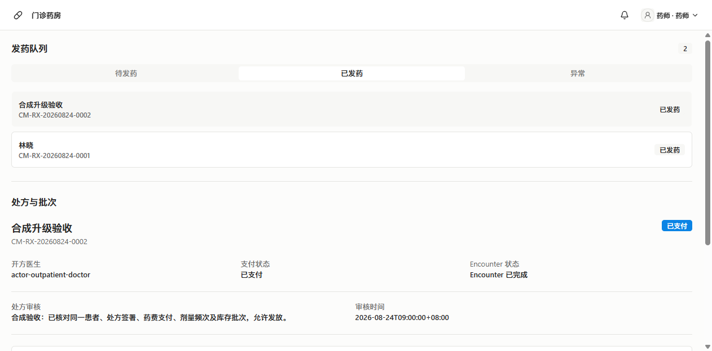
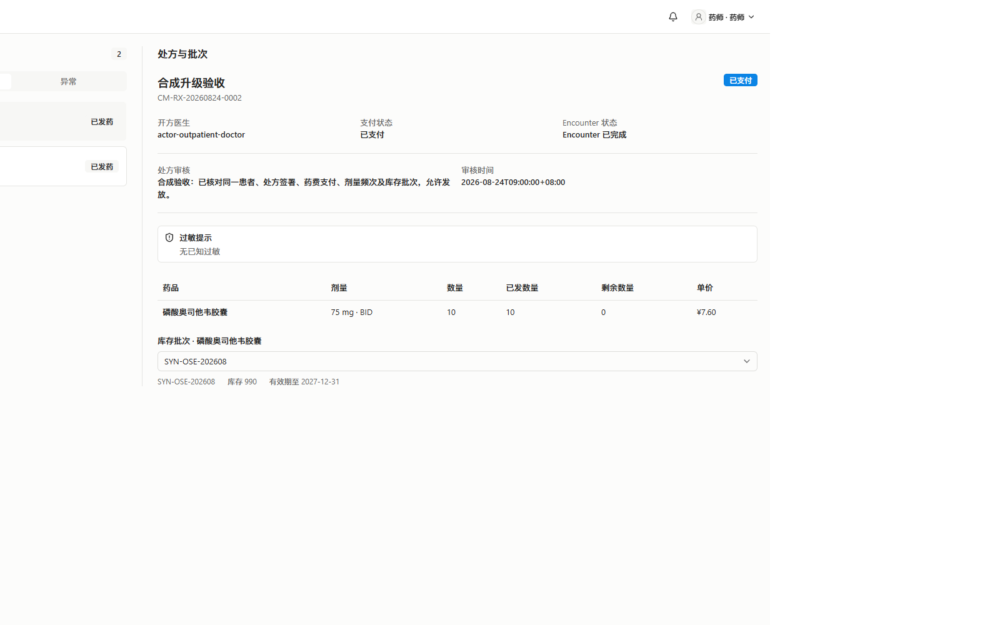

# 同一就诊的完整门诊闭环

本证据对应 [ClinMesh PR #94](https://github.com/CaiZongyuan/clinmesh/pull/94) 与 [issue #91](https://github.com/CaiZongyuan/clinmesh/issues/91)。合成患者“合成升级验收”的同一就诊已完成挂号、分诊、首诊、检验、复诊签署、支付和发药。此前停在待缴检验费的病例已续办完成，没有以候选患者的诊疗结果代替其后续交接。

## 运行边界

- 本次运行提交：`a9831c4b9437699a02b4aa70913cf80d3ed8b759`；产品源码未修改。
- Windows 真实入口：DSH `http://127.0.0.1:3091`，ClinMesh Server `http://127.0.0.1:51991`；使用原有隔离合成数据库和已构建产物。
- Workspace：`workspace-demo`；Epoch：`epoch-1`；Scenario Run：`scenario-run-1`。
- Case：`01a09eee-1afd-73fd-80b8-948331345b2f`。
- Encounter：`01a09eee-1afd-73fd-80b8-9c1d5e7eada5`。
- 这条审计链包含此前已完成的挂号、分诊与首诊，以及本次在同一就诊继续完成的后续业务；不声明所有步骤在本次重新执行。

## 可核对结果

| 岗位或阶段 | 结果 |
| --- | --- |
| 挂号、分诊 | 原挂号和分诊记录指向上述同一 Encounter；相应 Command、审计与轨迹存在 |
| 首诊、检验 | 原检验申请关联同一 Encounter；检验费 6800 分支付成功，LIS 模拟器生成正式报告 |
| 复诊 | 通过真实医生界面保存复诊草稿、预览并确认签署完诊；Encounter 与挂号状态均为 `completed` |
| 药品收费 | 磷酸奥司他韦胶囊 10 粒，药费 7600 分支付成功 |
| 药房 | 处方审核通过后发药；处方 `dispensed`，已发 10、剩余 0；批次 `SYN-OSE-202608` 库存 990、version 2 |
| 审计 | 导出的 15 个相关 Command 均 `completed`，各关联一个成功 Audit Event 与一个成功 Action Trace，requestId 一致 |

[结构化证据](evidence.json)仅包含该合成病例的业务标识、状态、金额、数量和关联审计字段。导出使用 `better-sqlite3` 的 `readonly: true`，不写数据库；业务变更均通过 DSH 中的真实 ClinMesh 岗位界面和正常模拟器完成，没有调用模型、直接写表或绕过确认。

## 界面证据

本次未生成新录像：启动录像命令被自动审批审查拒绝，仅返回 `blocked by policy`。以上 PNG 是最终状态截图，不能解释为过程录像。此前两段原生 WebM 保留各自原有范围；本目录使用同一就诊的完整审计链补齐岗位交接证据。

## 验证

- `agent-browser --session pr94-fix`：检验支付、复诊签署完诊、药品支付、药师审核与发药的真实界面操作成功；截图经目视检查。
- `node` 只读导出与断言：通过，0.16 秒。核对挂号/分诊的 Encounter、最终状态、两笔成功支付、已发数量，以及必需 Command 和各自唯一审计/轨迹关联。
- 未重跑代码测试、构建和 Mobile 检查：产品源码与依赖未修改，PR 当前提交的既有通过证据仍有效。

文件大小与 SHA-256 见 [checksums.json](checksums.json)。
